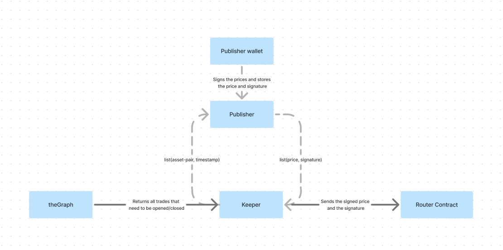

# Buffer Keepers

Keepers are bots that fetch the desired price feeds for a specific asset at a specific timestamp for opening and closing option trades.

## How it works

We have 2 keepers - one for opening the option trades queued by the users and second to unlock/exercise the options that have expired. These keepers keep running endlessly at an interval specified in WAIT_TIME.

In every iteration, the keeper calls a datasource to fetch the options which are to be opened or closed at the moment.
This datasource is theGraph's subgraph where we store all our blockchain data. For every option that needs to be executed the subgraph returns its asset pair and timestamp. The keeper sends a list of [{asset_pair, timestamp}] to the [publisher endpoints](https://oracle.buffer.finance/docs#/default/run_price_queries_price_query__post) which returns the corresponding price with a signature. The keeper sends a transaction to the blockchain with all this data and the signature is what helps in verifying that the price has come from a trusted publisher.



## How to run

Make a copy of .env.sample, name it as .env and add the desired config. Run the following command

```bash
./run_local_docker.sh
```
